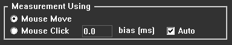
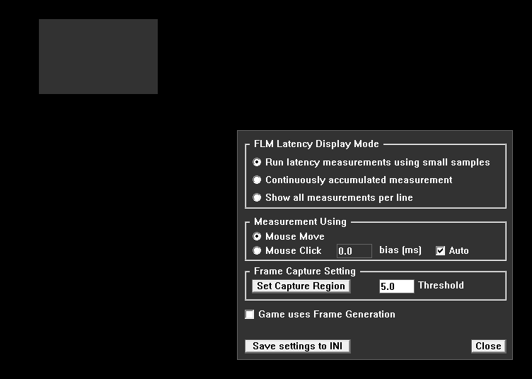

# FLM Users Guide

frame latency meter (FLM) application can measure a "click-to-photon" latency (mouse click and muzzle flash), and “aim-to-photon" (mouse scene movement) latency by default.
Once the mouse movement message is sent, FLM measures the time until the image on screen changes.

### Advantages

* FLM estimate the effective framerate - something the other devices cannot do.
* FLM is open source!

#### Using Mouse Scene Movement (Default setting)

* You don't need bullets to measure latency, so you never run out of ammo - you can (quickly) make as much measurements as you wish. As a result, the application can work autonomously to collect unlimited number of measurement samples, reaching a much higher accuracy.
* The measurement doesn't rely on the muzzle flash animation, which (depending on developer) may be rendered with a delay, producing inaccurate results.
* You can measure latency in games that don't shoot guns (shoot arrows or explore)

#### Using Mouse Click and Muzzle Flash (Optional)

* Option is provided to switch measurements over to mouse click mode at run time using a graphical user interface

### Choosing the right scene for measurement

* To measure the latency, FLM will make mouse movements in the right-left direction, moving the mouse back and forth by a small amount.
* To make sure FLM detects the image change, it is recommended to put the capture region next to a contrast vertical edge.
* Pick a region that has a significant pixel change between the left and right mouse move captured frames
* Make sure the capture region is more-or-less static - so the only reason for the captured image to change would be the movement of the mouse.

### Command Line

To show command line options run

flm.exe -help

It will display various options that can be selected to override any auto detect settings used to capture frames and instructions on how to run the application:

-AMF: capture frames using AMF codec (Default option, works only for AMD GPU's)

-DXGI: capture frames using a desktop capture codec (Works on any GPU connected to main display)

Running flm.exe with no command line option, will auto detect the systems vendor and GPU, then it will select the best capture codec to use.
if you want to override this feature, simply specify the capture codec to use in the command line.

For example:

flm.exe -DXGI

Will use the desktop capture codec, which will run on any GPU supported by DX11.

## How to run a test using mouse move

>**Step 1:** Configure your primary monitor to run the game on.

* Set the monitor to use free sync or have it set to an appropriate refresh rate try starting at 60Hz first.

>**Step 2:** Run flm.exe with “Run as administrator” 

* To see the capture region bounding box, press and hold right Alt key.  
If you are using multiple monitors and using the desktop capture codec, make sure you place the console window in the view of the primary display. Check that the bounding box color remains yellow, which means that the frame capture is running. If it shows a steady red color, then FLM codec shown on the console window is unable to capture frames and will not be able to measure latency.

>**Step 3:** Run the game.

* Adjust the game scene placement so that the FLM capture region is situated in an area where the scene transitions from dark to bright when the mouse is moved horizontally.

>**Step 4:** Select start measurements key combination (default is ALT+T).

* Wait for the capture process to start, it may take a few seconds to start as FLM process data, you should see the mouse move left and right in rapid concession while the application records latency measurements. Some games may require you to press down on the mouse keys to move the mouse left and right. If the mouse movements are too small, adjust the scene location or change the mouse steps in flm.ini using "MouseHorizontalStep".

* If you do not see any measurements or the measurements are slow, stop the measurements by pressing Alt+T and try another scene location with better contrast between left and right capture regions, if that fails review the adjust setting section for addition details on how to change the default settings.

* By default, FLM starts in "RUN" work mode, in which the output shows latency[ms] and latency[frames] averages of 16 consecutive measurements. The current work mode can be changed for the current session via the settings dialog, or a new default work mode can be set by modifying the INI file

   fps = xxx.x | ................ | latency = xxx.x | frames = x.xxx

* A running series of measurements will indicate the rate at which these latency measurements are occurring. If it is not moving or is slow - then stop the measurements (Step 5), change the game scene's location and retry. If you change the scene while the measurement is still running the average latency value will not be correct until it reaches a steady state value.

>**Step 5**:  Select stop measurements and review the output.

   Start measurements. 
   fps = xxx.x | ................ | latency = xxx.x | frames = x.xxx 
   Stop measurements. 

### GUI shown when you mouse right click on FLM console view
 

1. This window will remain in view until its either closed, using close button, right mouse click again, press ESC key or you start measurements.
2.  In some cases, it may be behind the console window when activated.

## How to run a test using mouse click

  

To use Mouse click you just have to set the option in FLM UI which is activated by a right mouse button click in the console window, all changes in the UI will take effect immediately when you start measurements. New settings will only save when either a capture region has changed or when "Save settings to INI" button is selected. 

Running measurements is like that of mouse move, except this time no measurements are displayed until a left mouse button click is set. FLM will show the current latency value measured and will continue to do so, accumulating values until a set number of measurements are made, it will then show this average value alongside the current measurement.

  

Setect "Save settings to INI". All setting will be updated into the flm.ini file for the next time you run the application. (Mouse option in flm.ini is set in MouseEventType)  
 

  

The auto check box enables auto bias setting, FLM will calculate a frame rate internally and adjust for the latency offset for the position the capture box is at, it will show you the calculated bias, the next time you open the UI.

  

When you close the application the Bias setting will be saved to the flm.ini file (The bias value will be placed in an appropriate MonitorCalibration_ location that match you monitors refresh rate).

Note: Bias will only be updates in the INI file when the ""Save settings to INI" is checked or if the capture region was modified.

  
The bounding box capture region can be moved from its default position to where games use muzzle flashes (same location as you will use to compare with a LDAT device). Best way to do that is by selecting “Set Capture Region” in the UI, move the region using the mouse down in the box, you can even resize the box if required.

  

Then select “Set Capture Region” button again or select “Close” button. 
This will update the flm,ini files StartX, StartY, CaptureWidth and CaptureHeight settings. And reset the capture pipeline to the new setting,
 
Once set you can start measuring mouse click to photon latency by clicking the physical mouse button, wait for muzzle flash and repeat as needed to gather all the measurements you need.
 
If you want to use mouse move just open the UI again and change to mouse move, no need to close the application.
 

### Change console output

  

To get more detailed printout of the latency measurements for each captured frame, change the INI setting "PrintLevel" to the "Operational Mode", which will print a value for each individual measurement, like this:

    fps = 60.0 | 72  71  70  69  67  67  65  64  80  79  78  77  76  75  74  73  | latency = 72.2ms | frames = 3.83

* fps - average framerate
* ... values - the latencies[ms] for individual measurements, the number of measurements is set by "MeasurementsPerLine" setting
* latency - latency [ms] averaged over the current row
* frames - latency [frames] averaged over the current row.

This is the same information that is been saved by default to a csv file.

When  "PrintLevel" is set to 2 Debug Mode, the output to the csv file is disabled. A list of detailed measurements is continuously printed to the console output while measurements are being processed. This mode is intended for debugging a capture codec and its setup.

### Saving Results to File

By default, FLM also saves measurements to a CSV file specified in flm.ini "OutputFile" setting. This file is overwritten with new results each time new measurements are started.

## Adjust Settings and Troubleshooting

Several options are available to confirm that the games frame capture is operational.

### Enable capture region bounding box.

Enable the "ShowBoundingBox" option in the flm.ini file (default is enabled)

When running a game in windowed mode you will see a "yellow" box when you press the right alt key, which will indicate what region is capturing frames, if the color changes to "red" then the current frame is not updating, or no new frame was captured.

### Save capture region to a BMP file.

Press the combination of RSHIFT key and the enter key once, the console will show a message that a file is saved with the name associated with the setting in flm.ini option "CaptureFile"

Note if the hotkey "RSHIFT+Enter" has been assigned in the game, change the key combination in flm.ini "CaptureFileKeys” to a new key combination.

### Capture performance

FLM should be able to capture any changes in the game capture region. To check if the frame capture rate is not dropping any changes, use the hotkey combination of LSHIFT key and the Enter key once this will start a frame sequence save to BMP files.

Note if the hotkey "LSHIFT+Enter" has been assigned in the game, change the key combination in flm.ini "ValidateCaptureKeys” to a new key combination.
The total number of files saved can also be set with the option in flm.ini "ValidateCaptureNumOfFrames"

When validating the capture performance of a specific capture codec, ensure that each frame in the game has a distinguishable frame of reference, example would be placing a incremental frame counter on the capture region for each render cycle, when LSHIFT+ENTER is selected, each BMP file frame captured should show the numerical frame counter in sequence, some maybe repeated which is a good indication that the codec is operating fast enough to process latency measurements, if you see out of sequence frame numbers then the capture codec used is not suitable for latency measurements.

Note: captured AMF frames are down sampled for faster processing, so make sure your frame reference indicator takes that into account; when using a frame counter make the font large enough so that the counter is still readable in the captured frames.

### Viewing frame capture trigger measurements

FLM calculates the absolute difference between a sequence of captured frames, it averages the values and then uses a threshold multiplier to
use as a trigger mechanism to signal a valid frame is ready to be processed for latency measurements.

A filter mechanism based on frame capture iterations "AVGFilterFrames" is used at the application start up to calculate a 1st order filter, which will periodically be used to reset the SAD averages down to 1% of the steady state. 

This calculation can be viewed real time on the console window, by setting the ini file option "PrintLevel" to Debug, this will enable more detailed printout of various measurements and threashold values. 
These measurements will only show if the LSHIFT key is pressed or frames are captured. if measurements show 0's then no capture is been processed.

## Measurement Threshold

  

Measurements are averaged and then scaled by a ThresholdCoefficientMove, which is used as a trigger to calculate a latency measurement.
Two values are used one for when mouse move event is used (default value 2.0) and the other ThresholdCoefficientClick for mouse click (default value 1.0)

Latency measurements are triggered using a formulation of various values ThresholdCoefficientMove, AVGFilterFrames, Current Sum of Average Difference (SAD) between 2 frames, a steady state filter (Alpha) and a running average of SAD.

 When a two frame have a SAD above a threshold limit, it will terminate a timer that is used to calculate a time from a mouse trigger event set by "MouseEventType" to the time it took to reach a threashold trigger value based on the following formulation:

AverageSAD = running SAD average from start of measurements, (minimum value set to 1.0)
alpha      = is the number of sample frames it takes to get to 1% of the steady state SAD values
iSAD       = current SAD value for two consecutive frames

    AverageSAD = AverageSAD * alpha + (1-alpha) * iSAD

such that AverageSAD will reach it's final position within a 1% of steady state using FilterFrames.
FilterFrames can either be  RunLatFilterFrames or AVGFilterFrames, which is set using PrintLevel = 0 or >= 1 respectively

    Alpha = = expf(logf(0.01) / FilterFrames)

Measurements stops when iThSAD > 0 where:

    ThresholdVal = ValAverageSAD * ThresholdCoefficientMove
       iThSAD = iSAD - ThresholdVal

Users can view the calculation values by setting "ShowSADMeasurements = true" and then pressing the toggle keys "SADViewKeys = some keys"
or a simplified view iThSAD only using "ShowThresholdLimit = true" which will show when latency measurements are triggered by the character prefix '*'

## BIAS: Monitor Calibration values in flm.ini file

A mouse clicks to monitor capture bias latency (end to end system) calibration is used for measurement of monitors with fixed refresh rates. This bias calibration is auto calibrated; however, a manual override is also provided to get a more precise value for your system setup.

In the flm.ini file set the "MonitorCalibration" constant values to offset the measured latency for specific monitor refresh rates.

For a more accurate reading of a full system latency adjust the values using the method described below.
Each monitor type may have different calibration values, to determine the correct value, use a hardware device as a reference.
such as a Reflex monitor which displays a full system latency from a mouse click to monitor screen capture region.

1. Set the required MonitorCalibration_...  to 0
2. Run FLM with the mouse click option checked and show all latency values option selected
3. Set the capture region using the "Set Capture Region" button, make sure the region selected matches the region your hardware monitoring device uses
4. Start measurements, and click the mouse
5. Watch the value displayed on the hardware device and record its value then subtract the value shown on FLM latency value
   use that value as the calibration offset, repeat the process to get an average value and set that value for the MonitorCalibration_xxx
   for refresh rates not shown use the closest MonitorCalibration_... setting (Range:0.0 to 100.0)

Check that the difference is reasonably constant for all measurements, the average value can now be used as a BIAS setting.
Once set you will no longer need to use cumbersome hardware devices and use FLM to monitor latency measurements.
If the differences vary considerably then FLM BIAS feature should not be used .and all "MonitorCalibration_..." should be kept at 0

### Software vs Hardware Latency Measurements

Hardware latency measurements, which measure the time from a physical mouse event to a pixel variation on a display monitor, are expected to have a fixed percentage difference compared to software latency measurements. Software measurements, only consider the time from the operating system mouse trigger event to a change in a scene's frame buffer, without considering the time it takes for the frame to move to and refresh at the monitor, as well as the varying time for mouse hardware to relay data to the OS for the mouse event. This accumulated sum of variations is termed as the Bias in FLM.

### Auto Bias

In the flm.ini set "AutoBias = true" or in UI Auto = checked to have FLM determine the constant BIAS required for mouse click latency measurement, default setting is true
if set to true all "MonitorCalibration_..." settings will be ignored, if false the closest measurement refresh  rate will be used as the BIAS for the mouse click latency measurements. To see the current auto bias value Start taking a few mouse click measurements and then Stop, open the user interface (Mouse right click in console window) and view the bias ms setting shown in the Mouse Click options row Note: when AutoBias is set to true at run time in FLM UI and then back to false prior to closing the FLM the corresponding MonitorCalibration_... will be overwritten and used when FLM AutoBias setting is false

## Keyboard Settings

frame latency meter application uses keyboard hotkeys "Alt+T" to start and stop latency measurements and keys "Alt+Q" to exit. If the game uses any of these keys change the key combination in flm.ini setting "MeasurementKeys"  to a new key combination for start and stop measurements and "AppExitKeys" for the application exit. See key options for additional details on what keys can be assigned.

### Assigning New Keys

You can combine up to 3 keys in sequence, using the plus sign as a separator between the key combination.

### Keys Options

The following keys are supported. L prefix is used for Left key and R is for Right key

### Type Keys:

ALT, LALT, RALT, CTRL, LCTRL, RCTRL, SHIFT, LSHIFT, RSHIFT, A to Z

### Enter (Return) key:

ENTER

### Arrow (Cursor Control) keys:

LEFT, RIGHT, UP, DOWN

### Numeric Keypad:

ADD, SUBTRACT

### Function Keys:

F1, F2, F3, F4, F5, F6, F7, F8, F9, F10, F11, F12

### Some examples:

ALT+T

CTRL+LSHIFT+T

## Capture Region

It is recommended that small capture regions be used, as larger areas require more processing time to determine a change in consecutive captured frames.

## Deterministic Measurements between Codecs

When comparing measurements between capture codec you will notice a difference in latency measurements, these can be due to several factors.

- Capture performance: AMF captures frames using driver level components, whereas desktop duplication is triggered at operating system levels.
- The difference in captured frames is not significant to trigger measurements consistently.
- Ensure that the games frames capture region are the same when comparing codecs.
- Mouse movements should be on the same scene coordinates.

## Console Window

The console window is used to display measured latency values, it is recommended that it is minimized when making measurements and the UI settings window be closed. Alternatively, you can set the topmost window setting “AppWindowTopMost” in flm.ini to false, which will place the window behind the game. Use the windows TAB keys to move between the game and the console window to view the measurements. Make sure the mouse has focus on the game when returning to capture frames for latency measurements.

Use ""AppWindowTopMost” set to true so that users can get accustomed to the FLM tool, it is recommended that the setting be set to false, when making measurements for analysis.

## Troubleshooting

FLM will display various color states around a capture bounding box:
- Yellow : FLM is capturing frames
- Red    : Capture is failing, try rerunning FLM again or change the codec option (run -DXGI or -AMF as command line options, for info on this run flm.exe -help)
- White  : Desktop capture refresh is not working, try rerunning FLM again.
- Blank  : Bounding box will not show when measurement have started, or FLM is not able to capture frames when the application is not set to run measurements.

Some debug options to see if FLM is working:

**Option 1**

Run FLM and select RSHIFT + Enter (programmable in flm.ini file as CaptureFileKeys = LSHIFT+ENTER ) this should print a message on the console “image file saved”.
Look at the folder where you ran the FLM application from, you should see a file called captured_frame.bmp (programmable in flm.ini as CaptureFile = captured_frame ) it should contain a portion of image capture box region. If its blank, then FLM is not capturing any frames.

**Option 2**

Turn on display of real time capture data analysis in flm.ini file by setting "PrintLevel" to Debug Mode. 

- BG/SAD/ThSAD > 0 means a capture was done.
If nothing changes, then FLM is not capturing anything.

Try updating the PC display drivers to latest version and check for windows update.
The PC must support DirectX 11 and DirectX 12.

## Known Issues and Limitations

* When games are running at high frame rates FLM measurements show higher values then those measured by hardware devices.
* Certain games may limit the utilization of desktop duplication screen capture, making the option to use the DXGI codec inoperable.
* The default settings may not trigger latency measurements. Try adjustments to settings, ThresholdCoefficient, RUNFilter and AVGFilter in the flm file.
* DXGI capture codec must be running on the primary display, else frame capture will be too slow.
* The current capture codecs are processing SAD measurements using CPU and may be too slow on some PC.
* FLM will not work using remote desktop connections.

